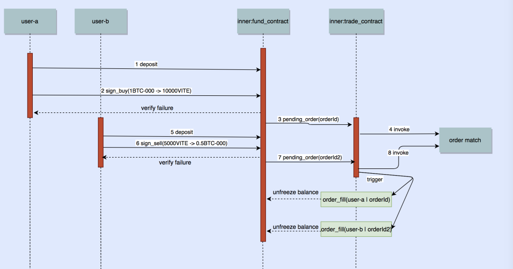
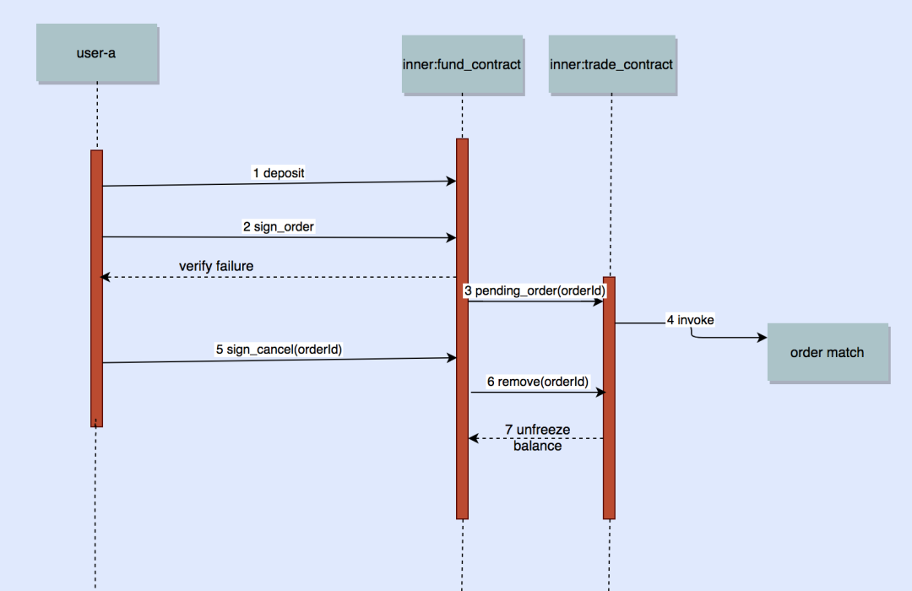

# Five Charts to Understand How ViteX Works

In the previous articles, we have introduced ViteX from many perspectives of contract design, matching engine, backend service, decentralization, etc. As one of the following educational material of ViteX tech explorations, this article will focus on the execution process and interactions of ViteX smart contracts and the user. Enjoy.

## 1 Functional Module

The ViteX decentralized exchange includes the on-chain data source vDex and the off-chain data service DexServer. As shown in the figure below, Wallet Gateway, Token Issuance, and DEX Manager are on-chain modules. Users can either map cross-chain tokens to the Vite chain through gateways or issue Vite-native tokens directly, then transfer the tokens to the exchange for trade. DEX Data Processor and Data Collection are off-chain modules. They collect data from full nodes, conduct data processing and indexing, and provide aggregated data service to the user. Specifically, DEX Manager handles deposit, withdrawal, trading, new trading pair opening, Data Collection crawls the chain to capture on-chain events, and DEX Data Processor is responsible for providing the service.

Assets traded on ViteX have two types. One is token issued on the Vite chain, such as VITE, VX, EBLX-000; another is cross-chain tokens like ETH-000, BTC-000, USDT-000. The cross-chain tokens are native coins of other public chain and need to be mapped to Vite tokens before they can be traded on ViteX.

## 2 Functional Details

Functional details are explained in the following sections.

### 2.1 Contract Design

ViteX adopts a multi-contract scheme, which is helpful to build a clear business model and avoid the potential performance bottleneck of single-contract, especially taking into account the large trading volume in the future. In addition, this design also facilitates data pruning.
The design consists of two built-in contracts. Contract Fund is responsible for asset deposit, withdrawal, settlement, lock, unlock, mining, dividends, etc., while the orders are actually matched in Contract Trade. The interaction flow is as follows:

1. User A sends 1 BTC-000 to the exchange account in Contract Fund. This is represented as a function call to the contract;

2. User A signs an order placement transaction and sends to Contract Fund. The contract verifies the transaction and locks the BTC-000 if the verification has passed. Otherwise, the order placement fails;

3. Contract Fund calls Contract Trade to place the order;

4. Contract Trade puts the order on the order book;

5. Step 5 to 8 repeats the order placement process for another User B. In step 8, the order placed by User A will be taken if the price has matched. We will look into the matching process in next section.

### 2.2 Order Matching

The order maching process is shown in the following diagram.

1. User A first sends 1 BTC-000 to Contract Fund;

2. User A sends a function call to Contract Fund to place an order to buy 10,000 VITE with 1 BTC-000;

3. After the order placement transaction is verified, Contract Fund calls Contract Trade to place the buy order;

4. Contract Trade actually places the order on the order book;

5. User B sends 5,000 VITE to Contract Fund;

6. User B sends a function call to Contract Fund to sell the 5,000 VITE to 0.5 BTC-000;

7. Contract Fund calls Contract Trade to place the sell order;

8. Contract Trade matches the order with the buy order of User A. When it completes, 5,000 VITE and 0.5 BTC-000 are respectively sent to the accounts of User A and User B in Contract Fund (Trading fees are not taken into account in the example). At this time, B’s sell order is fully filled and removed from the order book, while A’s buy order is partially filled and will remain on the order book at the moment.

### 2.3 Order Cancellation

Only pending (unfilled or partially filled) orders can be canceled. Attempt to cancel a filled or canceled order will cause an error.

1. Steps 1 to 4 represent the order placement process of User A;

2. In step 5, User A signs an order cancellation transaction and sents to Contract Fund;

3. After the order cancellation transaction is verified, Contract Fund calls Contract Trade to cancel the order, the latter will remove the order from the order book;

4. Contract Trade unlocks the assets and returns to the account of User A in Contract Fund.

### 2.4 Settlement

On ViteX, wallet balance and exchange balance are different. Trading is related to exchange balance. When you transfer assets to another user or withdraw through a gateway, you should move the assets from the exchange account to the wallet first.

1. In step 8 of last chart, User A signs a withdrawal transaction and sends to Contract Fund;

2. After the withdrawal transaction is verified, the assets are moved to the user’s wallet from the exchange.
