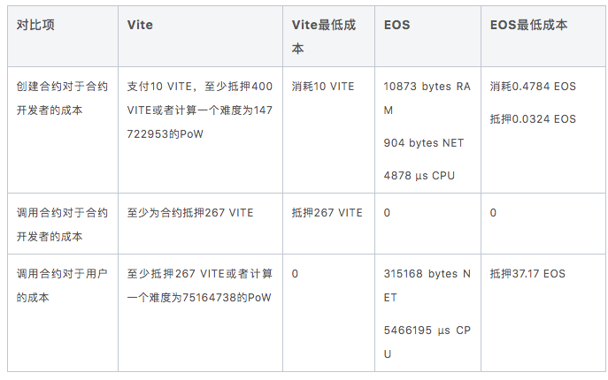
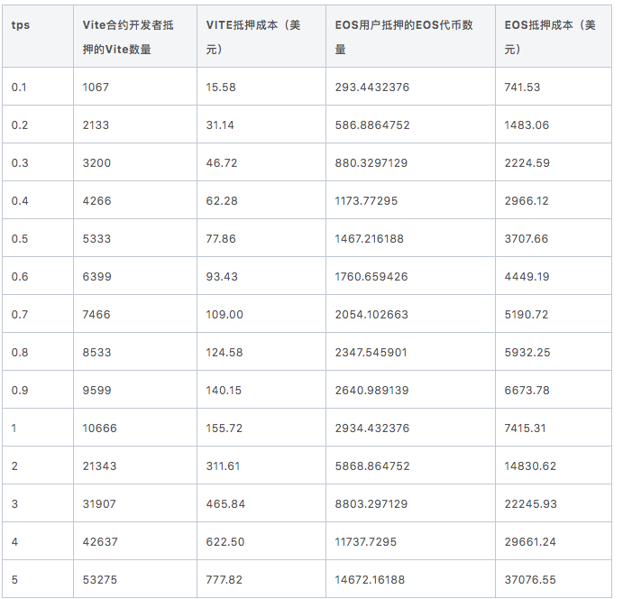

# 技术分享——Vite与EOS智能合约成本对比

## Vite的合约成本

Vite合约的成本取决于使用的资源，包括CPU、带宽、存储、内存等，我们将这些资源消耗转换为配额。配额可以通过抵押VITE coin来获取，只要抵押的VITE coin不取回，就可以持续获得配额。抵押VITE coin的数量和获得的配额数量由配额公式决定，资源使用频率越高，就需要抵押越多的VITE coin。另外，由于Vite中的合约调用是异步的，一笔合约调用交易会被拆分成一个请求交易和一个响应交易，需要分别消耗一定配额。（注：除抵押外，用户账户也可以采取计算PoW的方式单次获取一定免费配额，适用于非高频操作场景）

### Vite合约的成本包括两部分：

1、创建合约的成本：创建合约时合约开发者需要支付10Vite的创建费用（这10Vite会销毁）。另外，发起创建合约的请求交易需要消耗合约开发者账户的配额，创建合约的响应交易不额外消耗配额。

2、调用合约的成本：调用合约的请求交易和响应交易会分别消耗发起请求交易的用户账户的配额和生成响应交易的合约账户的配额，前者需由用户账户抵押或计算PoW获得，后者则通常来自于合约开发者对合约的抵押。

## EOS的合约成本

EOS合约的成本用3种资源来衡量：RAM、CPU、NET。
RAM用于链上存储，包括账户余额、公钥、抵押、投票、合约状态等，例如创建一个普通账户需要消耗4KB RAM来存储账户信息。对于一个合约来说，它使用的RAM包括合约代码和合约状态，其中合约状态是指通过EOS的DB接口保存的数据，这部分费用可以由合约承担，也可以由用户承担，由合约开发者指定。只要使用了链上存储就必须持有RAM，只有当资源被释放后才能回收RAM。RAM需要通过在二级市场交易的方式来获取。RAM价格可以通过Bancor Algorithm计算。
CPU和NET，即执行时间和带宽，计费方式类似。都是使用者计费。通过抵押EOS代币分别获得CPU和NET资源，抵押1个代币获得的资源数量取决于当前的总抵押数。CPU和NET资源数量分别决定了一个账户在过去3天内执行的毫秒数和使用的字节数。每次交易都需要消耗CPU和NET。抵押数量决定了在最近3天内平均每次交易可以执行多长时间，使用多少带宽。

### EOS合约的成本同样可以拆分成两部分：

1、创建合约的成本：创建合约时合约开发者需要消耗RAM来存储合约状态，并且需要持有CPU和NET来执行合约创建交易。

2、调用合约的成本：调用合约时，调用合约的用户需要持有CPU和NET来执行合约调用交易。如果涉及到合约状态存储，还需要消耗RAM，这部分RAM要么由用户承担，要么由合约承担（即合约开发者提前为合约购买足够的RAM，可在合约创建时由开发者指定，但通常由用户承担）。

## Vite和EOS合约成本对比

## 示例

下面用一个简单的竞猜合约来对比Vite和EOS具体的资源消耗。

合约包含一个名为guess的方法，入参为一个数字，范围为0-9。取随机数，如果随机数最后一位和入参相同，则打印”赢了“，否则打印”输了“。

### Vite合约代码如下：

pragma soliditypp ^0.4.2;
contract bet {
    event win();
    event lose();
    onMessage guess(uint8 target) {
        uint64 random = random64();
        if (target == random % 10) {
            emit win();
        } else {
            emit lose();
        }
    }
}

#### 部署合约时：

合约开发者支付10 VITE用于创建合约，至少抵押400 VITE或者计算一个难度为147722953的PoW来发起创建合约交易（消耗配额45956）。

#### 调用合约时：

用户需要至少抵押267 VITE（每75个快照块可以发起一笔请求交易，大约间隔75s）或者计算一个难度为75164738的PoW（每产生一个新的快照块可以发起一笔通过PoW来获得配额的交易，大约间隔1s）来发起调用合约请求交易（消耗配额23448）。

合约开发者需要至少为合约抵押267 VITE来发起合约响应交易（每75个快照块可以发起一笔合约请求交易，大约间隔75s）（消耗配额22288）。如果全网出块率为95%，那么抵押267 VITE三天最多能发起3283笔响应交易。

### EOS合约代码如下：

#include <eosiolib/eosio.hpp>
#include <eosiolib/print.hpp>
using namespace eosio;
 
class bet:public eosio::contract {
  public:
    using contract::contract;
     
    [[eosio::action]]
    void guess(uint8_t target) {
      auto random = current_time();
      if(target == random % 10) {
        print("win");
      } else {
        print("lose");
      }
    }
};

#### 部署合约时：

合约开发者创建合约账户，消耗200 bytes NET和214 µs CPU；

合约开发者更新合约代码和ABI，消耗704 bytes NET和4664 µs CPU。

合约部署完成后，共占用10873 bytes RAM，购买这些RAM大约需要0.4784 EOS。

#### 调用合约时：

用户发起调用合约交易，消耗96 bytes NET和1665 µs CPU。如果用户要在3天内发起3283笔调用合约交易，那么需要至少抵押0.36 EOS NET和36.81 EOS CPU。

注：2019年5月24日，RAM价格大约为1 EOS = 21.975 KB，NET价格大约为1 EOS = 0.84 MB，CPU价格大约为1 EOS=148.5 ms。

不同交易规模下Vite合约开发者和EOS用户抵押代币价格对比：
其中，0.1 tps指合约每10s接收一笔交易。

注：1 VITE = 0.0146美元，1 EOS = 2.5270美元
### 结论
1.Vite的智能合约部署和调用成本远低于EOS；
2.和EOS比，Vite更适合高频场景。

