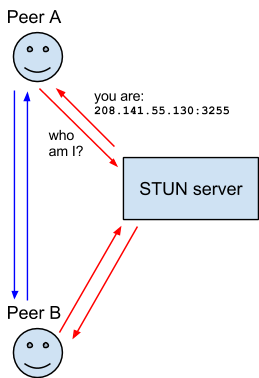
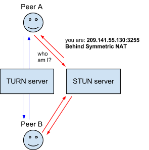

# ViteConnect——扫码登录ViteX，让你的资产更安全

## 背景
随着第三方网关入驻[vitex](https://x.vite.net/trade?symbol=VITE_BTC-000),vitex网页中越来越的的第三方服务也带来越来越多的安全风险。以往助记词存储在浏览器本地的方案日不足。迫切需要寻求一个远程签名方案，实现助记词与页面分离。通过手机app扫码登录的方案，用户成本低，不需要购买昂贵的硬件钱包。使用成本低，可以利用已经在手机中导入的助记词，不需要再在插件中再次导入助记词。且已经有很多开源的方案，开发成本较低。

## 调研：
在github上发现了两个相关方案：

https://github.com/MyEtherWallet/MEWconnect

https://github.com/WalletConnect/walletconnect-monorepo

两个方案的不同主要区别在于peer之间的连接方式，这里我感觉与webrtc连接方案类似，所以用mdn上关于 [webrtc](https://developer.mozilla.org/en-US/docs/Web/API/WebRTC_API/Protocols)架构的一些术语来描述，下面一些图片也引用于mdn。

## [mewconnect](https://github.com/myetherwallet)
1，mewconnect实现了一个类似于STUN server的中间信号服务器。可以检测两个peer的nat类型，并向双方暴露对方的公网地址（某些nat类型下无法实现）。

2，后面就是两个peer之间的直接通讯。

tips:

mewconnect官网宣传中，与其它同类产品相比主要亮点是P2P通信可以实现无中间服务器，第三方无法访问通讯数据。这点可以通过在应用层建立加密层，对中间服务器透明来实现。（个人猜测webrtc由于大部分场景是针对音/视频数据，如果完全使用中间服务器，服务器压力较大，采用p2p通信的方式有一定优势）并且国内3/4G网络多处于对称型NAT环境中，难以实现p2p通信。

## [walletconnect](https://github.com/trustwallet/walletconnect-monorepo)
walletconnect 实现了一个类似与TURN server的中继服务器（图中蓝色部分）

也是我们最终使用的方案。

## walletconnect的握手过程：
1，web端生成一个密钥 key，handshakeTopic，以二维码的形式展示出来，二维码同时包含服务端的地址。

2，web端向服务器 的handshake topic 发送一个会话请求（session request），包含webclient topic，同时向服务器订阅 webcilent topic的消息。

3，mobile端扫码，连接到服务器，并从handshaketopic中取出 会话请求（session request），尝试用key解密消息，得到webclienttopic，后续发送给web的消息讲通过这个topic发布。同时发送一个 approveSession消息给web，携带mobileClientTopic 发送给web端。

4，web端收到approveSession，记录mobileClientTopic，后续通过mobileClientTopic 向mobile通道发送消息。

## walletconnect特点：
整个过程的消息都是通过key加密的，对服务器透明
会话建立过程中通过handshaketopic交换了双方的私有topic，该topic不对外透露。
一个会话过程中，session request只发送一次，且只能被消费一次，保证了即使二维码中关于handshakeTopic、key等内容泄露，攻击者也无法获取到双方通讯的topic。
## 一些问题：
key在交换握手阶段没有更新并交换，如果二维码泄露，第三方获取到消息可以轻易解密。
peerTopic 只生成一次，缓存在本地（至少web,ios实现是这样），一旦泄露一次，就埋下安全隐患。
两个peer之间无法感知对方状态，服务器也无法感知两个topic的对应关系，可能是出于安全考虑尽量削弱peer，服务器之间耦合。但是这样也给服务器层去做重连等功能带来了难题。
服务端和web端（ios/android没有了解）均以 socket.readyState===1 来判断消息是否可以发送。但是经过测试(node)，因网络问题断开连接后，socket.readyState经过5～7s才会有变化。这个区间发送的消息有可能丢失。
总体来说 ，安全性考虑非常多，握手过程设计巧妙。但是工程实现中感觉非常匆忙，没有重连机制、服务端消息topic存储结构不太合理，且没有回收机制，各端的版本控制和兼容升级没有考虑。

## 我们的工作（ViteConnect特性）
1，由于用户在国内外均有分布，国内网络环境复杂，一个中心化服务器延时高，稳定性差（多服务器正在计划中）。第一个问题就是要解决两个peer之间状态感知问题，不能让mobile由于网络原因断开后,web端一直pending在消息发送的状态。vite connect 引入业务层心跳，10s内没有检测到对方心跳，主动通知对方自己退出，同时自己断开。

2，实行一个session一个topic，使topic回收成为可能。长时间（1h）未使用的topic将被回收。

3，服务端加入加入简单的监控，使之成为工程上可用的产品。

第一版发出后，随着vitex上线，当日ViteConnect 峰值topic 数在3700左右，即大约有1200个用户同时在线。

## 第二次优化
第一版上线后有用户反馈，消息有时收不到，连接会因为手机锁屏而断开。稳定性和实时性是一对矛盾的要求，即在网络环境差的情况下是持续等待消息到达还是立即断开让用户感知，这是产品中的权衡。在考虑了app保活的难度，和网络延迟的影响后，我们计划实现重连机制。主要做了以下几方面的事情：

1，增加消息编号，为每条消息实现一个编号，peer在重连后可以从上次断开的地方重新订阅，保障消息的到达，实现重连。

2，丰富更多的消息类型，让服务端可以实现更多功能。主要有以下种特点的消息：

   session相关的消息出于安全考虑 只应被消费一次
  
   peer与服务端之间的消息不应被key加密，可以利用服务器做一些连接优化。
   
   普通消息应在一定时间内被保留在服务端，以等待其他peer重连时重新订阅。topic超过一定时间未被更新时被回收。
   
3，版本控制，消息、peer的版本应该被服务器知道，服务器在对待不同版本的peer、消息时兼容不同的处理方式。

参考资料：

https://developer.mozilla.org/en-US/docs/Web/API/WebRTC_API/Protocols

https://github.com/MyEtherWallet/MEWconnect

https://github.com/WalletConnect/walletconnect-monorepo

https://github.com/WalletConnect/node-walletconnect-bridge

https://www.jianshu.com/p/a6713687bc1d

https://www.jianshu.com/p/ecde412d2eeb
