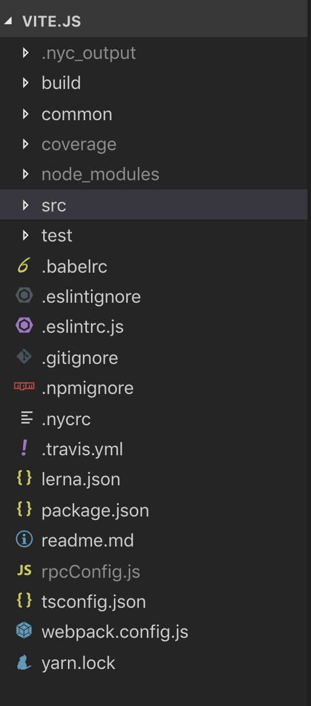
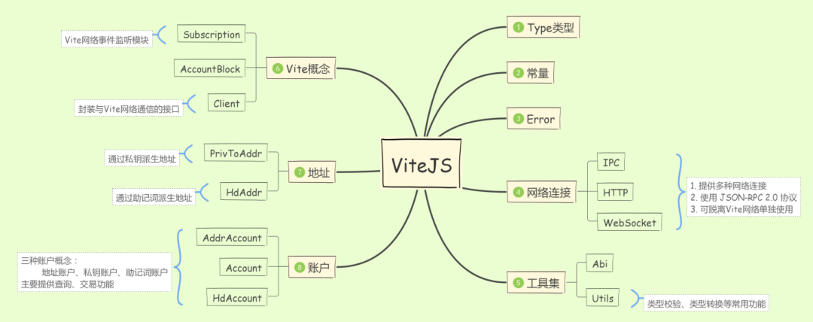
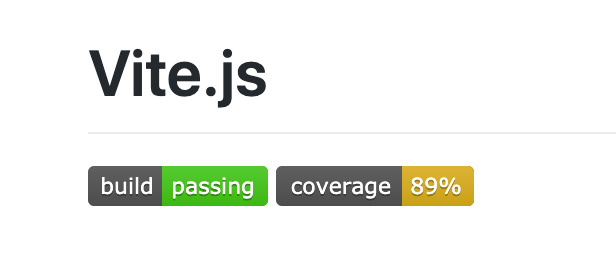
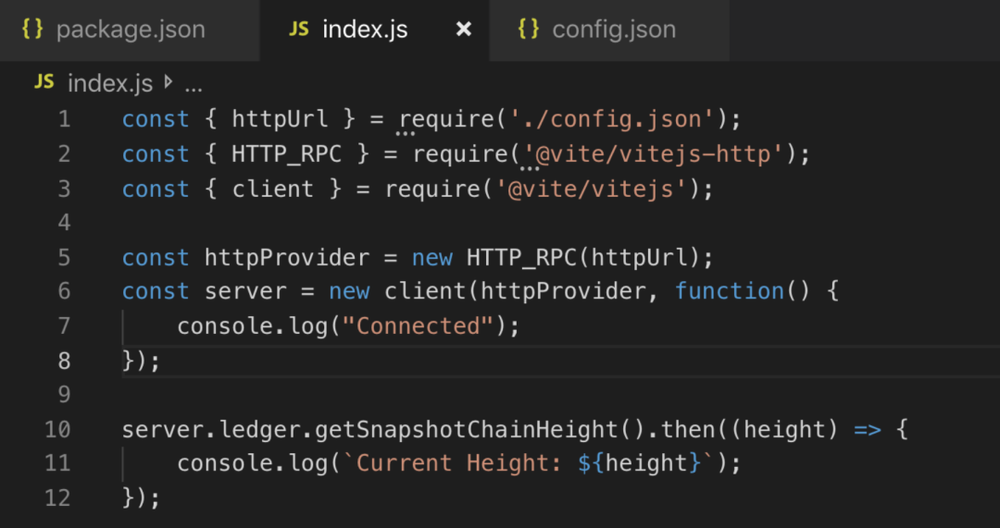
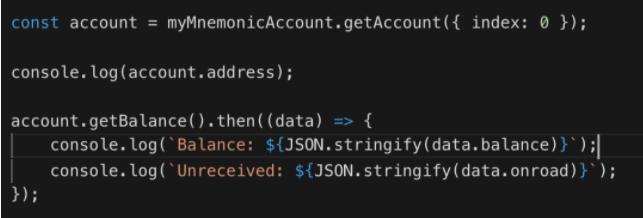
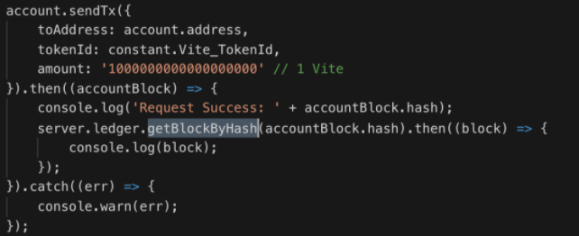

# 泛谈ViteJS

这篇文章会给大家浅谈ViteJS的开发选型以及应用，并提供简单的应用例子。

ViteJS定位：JS版本的工具包集合

ViteJS主要提供：
* 基础功能，如网络连接、abi解析、地址派生等；
* 包装GoVite-API，如事件监听，获取交易列表，发送各类型交易等；
* 便捷功能，如通过助记词生成账户实例，实现快速发送交易等。
* 通过ViteJS可以快速构建钱包、开发DApp、连接全节点进行数据查询等等。

## 开发环境

ViteJS基于TypeScript开发

* 包管理：yarn
* 构建：webpack
* 测试：mocha
* JS包版本控制和发布：lerna

### 为什么使用TypeScript
JS是一门动态类型语言，表现十分灵活；
但同样的，JS没有类型检查；提供对外接口代码补全、智能提示都不够友好；书写不规范很容易诱导发生很多隐蔽的bug，而且影响代码的可读性。
为改变这些问题，我们决定引入TypeScript。

* TypeScript是JS的超集，对JS有很好的兼容性；
* TypeScript提供类型推断、类型定义以及类型检查；
* 代码开源、兼容第三方库、IDE插件齐全、社区也很活跃、上手难度低等等.......

### 为什么使用lerna
上文已经提到过，ViteJS是Vite的JS版本的工具包集合，明确这个定义之后，我们已知ViteJS将具备以下特点。
ViteJS 将提供多个工具包；

工具包间的依赖会很小或者很明确；

开发DApp或者其他功能，为减少打包后大小，使用者将会倾向于自定义使用某几个工具包的组合，而不是全局引入一个ViteJS包。

这些特点决定了，我们需要一个可以帮助我们管理工具包间依赖、版本、发布的工具。lerna可以很好的实现这一点。
* lerna可以让我们在一个git仓库中管理多个发布包；
* lerna可以帮助我们处理好包间依赖，以及安装各个包的依赖；
* lerna让发布流程变得更加清晰、简单：自动打tag、可以生成changLog、更新包版本等等.....

## 目录结构

ViteJS的目录结构十分简单，开发只需关注3个文件夹：build(构建)、src(源码)、test(测试)。

## 源码结构

由ViteJS是一个工具包集合 以及 选择的包管理工具lerna，已经决定了ViteJS将是一个脉络清晰的平铺化管理结构，每一个功能集将形成一个单独的文件夹，进而发展为一个单独的包。
这种管理结构为我们带来了很大的优势：
* 代码逻辑、目录结构十分清晰，可读性很强；
* 模块间依赖、包管理结构十分明朗，无论使用者还是开发者调用都更加简洁；
* 功能明确，强势的避免了修改某个功能点，造成额外bug这样的尴尬情况。

## 测试

良好的代码结构提供了更清晰的测试流程。
测试目录基本基于src目录进行创建，每个功能集都拥有自己的测试文件夹。
通过git hook，每次commit之前都会执行用例，测试用例不全部通过则不能提交代码。
而git仓库首页则会显示build结果和测试覆盖

## 通过ViteJS创建自己的钱包

Demo：[https://github.com/lovelycs/ViteJS-demo](https://github.com/lovelycs/ViteJS-demo)

### 开发环境

node: v11.4.0

yarn: v1.15.2

### 初始化项目

1. 新建文件夹ViteJS-demo
2. ViteJS-demo文件夹下执行指令yarn init，按步骤初始化项目
3. yarn add @vite/vitejs
4. yarn add @vite/vitejs-http ，ViteJS-demo 默认使用http协议
5. ViteJS-demo文件夹下，新建 index.js 和 config.json

初始化完成，你的项目看起来像是这样

### 连接节点

务必将 config.json 添加到. gitignore 文件中，因为接下来我们将从 config.json 当中读取你的全部配置。

务必记录自己的助记词，并注意隐藏，切勿使用未知助记词，谨慎向未知地址转账。

1. 选择自己的测试节点，并配置到 config.json 当中的 http 选项
2. 将自己的助记词配置到 config.json 当中的 mnemonic 选项。

### 开始连接节点

1. index.js 中建立HTTP服务
2. 新建 client 用于快速调用 GoVite-RPC-API

3. node index.js 输出如下结果，则代表通信连接建立成功

### 创建自己的账户

1. 传入助记词 和 client，即可以创建出自己的助记词实例与节点进行通信
2. node index.js 成功输出助记词，则代表实例创建成功

3. 通过 myMnemonicAccount.getAccount({ index: 0 }) ，获取助记词下的0号地址实例

4. getBalance接口可以获取到账户余额以及在途金额

## 开始发送交易

1. 为自己抵押一些配额，并通过getPledgeQuota接口，查看配额是否生效

2. 如果有未接收交易，则可以通过account.autoReceiveTx();开启自动接收交易
3. 发送交易，拿自己的地址进行测试

到此为止，已完成钱包基本功能。

### 相关概念引导
ViteJS git仓库：[https://github.com/vitelabs/vite.js](https://github.com/vitelabs/vite.js)

ViteJS 文档：[https://vite.wiki/api/vitejs/](https://vite.wiki/api/vitejs/)

Vite 教程：[https://vite.wiki/tutorial/start/](https://vite.wiki/tutorial/start/)

DApp 开发指南：[https://vite.wiki/zh/tutorial/contract/dapp.html](https://vite.wiki/zh/tutorial/contract/dapp.html)

ViteJS 应用demo：[https://github.com/lovelycs/ViteJS-demo](https://github.com/lovelycs/ViteJS-demo)
