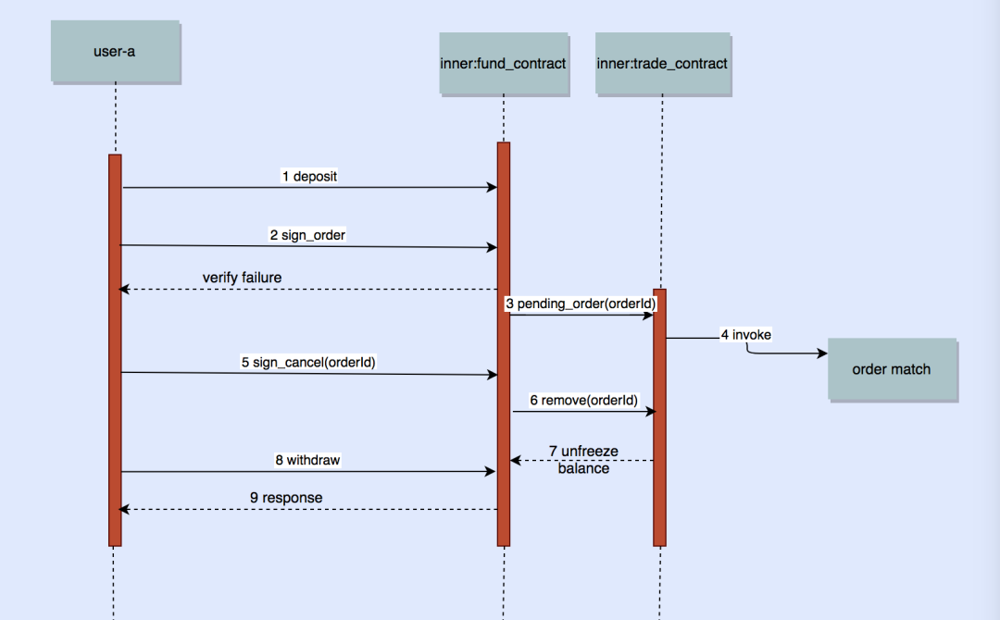

# 图解ViteX设计

在之前的文章中已经较详细的介绍过ViteX的设计，大家也对ViteX有了一定的了解，本文将采用图文的方式更直观的向大家介绍ViteX的执行流程，提供大家一个更直观的认识，下面将从宏观角度功能模块和微观角度功能细节不同的视角进行介绍。

## 1、功能模块

ViteX去中心化交易所从整体上分为链上数据源vDex和链下数据统计DexServer两部分。如下图所示，上面部分为整个链上行为过程，通过网关映射或者在Vite链发行原生币，然后在交易所进行交易；下面部分即是链下服务通过在节点上进行数据收集，然后进行一系列统计之后展示给用户的过程。Dex Manager即管理充提、交易、开交易对等等交易所行为；Data Collection即爬链服务，抓取所有的链上行为；Dex Data Processor即统计服务，对抓取到的数据进行各种指标统计，最后展示给用户。
ViteX上交易的币种都是在Vite公链上发行的代币。这些代币分为两种，一种是直接在Vite链上发行的代币，例如VITE、VX、GXTX-000等，这种币只存在于Vite链上；第二种是由网关映射过来的代币，例如ETH-000、BTC-000、USDT-000等，这些代币的原生币在其他公链，需要进行映射才能在ViteX上交易。

## 2 、功能细节

在第1节中整体介绍了ViteX的功能模块，下面将从4个细节设计方面进行介绍。
### 2.1 合约设计
ViteX 采用多链模式，较单链模式而言业务边更清晰，并且考虑到日后交易量大，避免了单链的性能瓶颈，也方便数据的裁剪。
由内置资金合约及交易合约组成；资金合约负责资金充提、结算、冻结、挖矿、分红等；交易合约负责订单撮合。合约流程如下图：

用户A充值10BTC-000到交易所账户，即是到资金链；

用户A签名发起一笔下单交易到资金链，此时资金链会进行验签、冻结余额等操作，若有失败，则下单失败；

第2步验证成功之后资金链会先交易链发起一笔挂单交易；

新来的订单进入订单薄；

5到8就是第二个用户的下单操作，第8步时会进入订单匹配逻辑，会进行吃单或者挂单操作；

### 2.2 订单匹配
如下图流程所示：
第一步，用户a先充值资金到交易所账户中，即用户先资金链发起一笔充值交易；
第二步，然后向资金链发起一笔买单交易（1BTC-000购买10000VITE），经过资金链验证成功之后执行第三步；
第三步，资金链向交易链发起一笔挂单请求；
第四步，挂单进入订单薄；

第五步，用户b先资金链充值；
第六到第七步，用户b发起卖单交易（出售5000VITE得到0.5BTC-000），这笔交易进入订单匹配逻辑；
第八步，新来订单发现有满足要求的相反方向的已知订单orderId,进行匹配撮合，然后把兑换币种分别写入用户a和用户b的交易所账户中，完成此次撮合过程；orderId2完全撮合，订单变成已完成状态，从订单薄中移除，而orderId只部分撮合，仍旧保留在订单薄中。
具体撮合过程在《ViteX内置合约设计与实现简介》已详细介绍。
### 2.3 撤单设计
用户撤单：

撤单操作针对用户挂单而言，撤销一笔已经撤过的订单会报错。
第1到4步是用户的挂单过程，撤单时由用户签名一笔撤单交易，参数为需要撤销的订单id，发送到资金链；资金链进行一系列正确性验证之后，向交易链发起一笔撤单交易，然后由交易链从订单薄中移除该订单。然后释放冻结的金额到用户交易所账户中，完成整个撤单过程。
### 2.4 结算设计

在ViteX中，用户余额跟交易所余额是独立的，所有的交易操作都是跟交易所余额关联，当你在ViteX里面赚钱之后就可以从交易所余额提现到用户余额里面，然后进行用户转账、网关提现等操作了。
结算由用户签名一笔提现交易发送到资金链，如图中第8步所示，资金链经过合法性验证之后，释放相应的金额到用户账户中，完成提现操作。
总结：从2.1 到 2.4的流程可以看出，ViteX的一系列操作都是在链上进行，所有数据都是链上存储，公开、透明、完全去中心化的操作。资金安全由用户保证。
